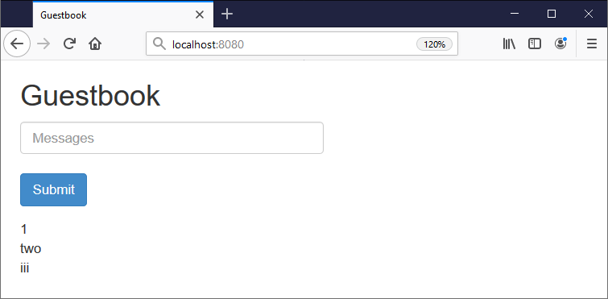

# Guestbook Demo App

Welcome to the Guestbook sample! It's a very simple PHP application which uses Redis as a data store.

This source code was scaffolded by a Docker Application Template. The template also:

- created a GKE cluster `{{range .Services}}{{if eq "gcp" .ID}}{{.Parameters.project}}{{end}}{{end}}-gke` in GCP project `{{range .Services}}{{if eq "gcp" .ID}}{{.Parameters.project}}{{end}}{{end}}`
- deployed [Compose on Kubernetes](https://github.com/docker/compose-on-kubernetes) to the cluster
- generated a [docker-compose.yaml](../docker-compose.yaml) manifest to deploy the app

## Run the App Locally

Docker Application Designer uses the [docker-compose.yaml](../docker-compose.yaml) manifest to run the app locally.

Click _Start_ in Application Designer in the app isn't already running. Then browse to:

- http://localhost:{{.Parameters.externalPort}}

You should see something like this:



## Check the Code

There's not much to it. The Angular front end is in [controller.js](./controller.js) and the PHP back end is in [guestbook.php](./guestbook.php). 

You can edit those files and click _Restart_ in Application Designer to update your app.

## Deploy to GKE

Your GKE cluster has been provisioned with [Compose on Kubernetes](https://github.com/docker/compose-on-kubernetes), so you can use **the exact same** [docker-compose.yaml](../docker-compose.yaml) manifest to deploy to GKE.

Open a terminal at the root of this project, where you'll find the `docker-compose.yaml` file. Now push your Guestbook application image to Docker Hub:

```
docker-compose push
```

The template created a GKE cluster using your Service Account credentials. Now you need to get access to that cluster using your own GCP account:

```
gcloud container clusters get-credentials {{range .Services}}{{if eq "gcp" .ID}}{{.Parameters.project}}{{end}}{{end}}-gke --zone {{range .Services}}{{if eq "gcp" .ID}}{{.Parameters.zone}}{{end}}{{end}} --project {{range .Services}}{{if eq "gcp" .ID}}{{.Parameters.project}}{{end}}{{end}}
```

> Now you can run `kubectl` and `docker stack` commands locally, connecting to your GKE cluster

Deploy the application as a Docker Stack using the Compose file:

```
docker stack deploy --orchestrator=kubernetes -c .\docker-compose.yaml guestbook
```

[Compose on Kubernetes](https://github.com/docker/compose-on-kubernetes) generates Kubernetes manifests from the Compose file and deploys standard Kubernetes objects. You can use `kubectl` to get the public IP address of the Guestbook app running on GKE:

```
kubectl get svc guestbook-php-published --watch
```

> Browse to the external IP on port 8080 and you'll see the app running

You can also browse to [Google Cloud Console](https://console.cloud.google.com/kubernetes/list?project={{range .Services}}{{if eq "gcp" .ID}}{{.Parameters.project}}{{end}}{{end}}) too see the [workloads](console.cloud.google.com/kubernetes/workload?project={{range .Services}}{{if eq "gcp" .ID}}{{.Parameters.project}}{{end}}{{end}}) and [services](https://console.cloud.google.com/kubernetes/discovery?project={{range .Services}}{{if eq "gcp" .ID}}{{.Parameters.project}}{{end}}{{end}}) that have been deployed.

### Credits

The Guestbook app comes from the [Kubernetes examples](https://github.com/kubernetes/examples/tree/master/guestbook).